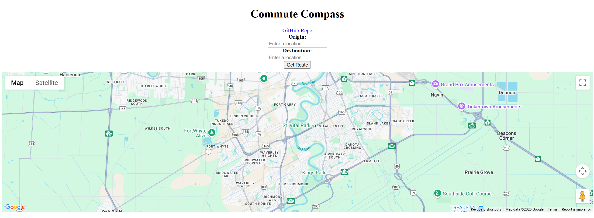
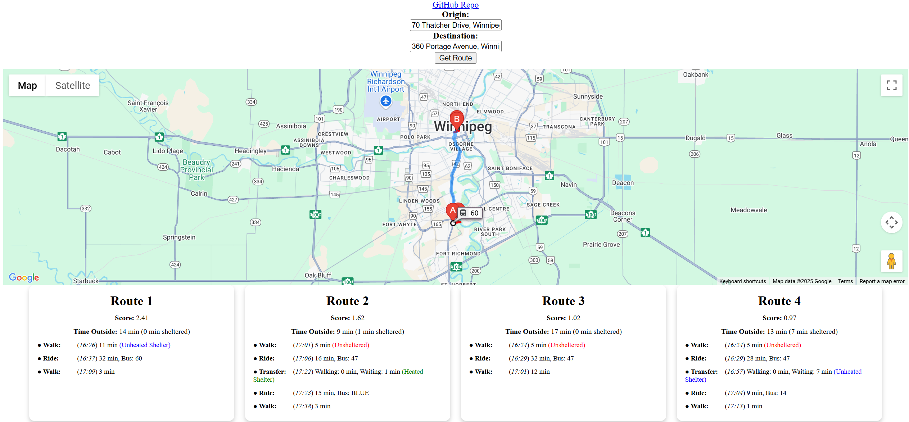

# Winnipeg Bus Trip Planer (Commute Compass)

 Winnipeg Bus Trip Planer is a web application with **React** and **Node.js** aimed at optimizing transit trip planning in Winnipeg and minimizing outdoor waiting times based on scheduled routes and sheltered stops. [Winnipeg Transit API](ttps://api.winnipegtransit.com/) is utilized to fetch route and stop information, Node.js for backend requests, and Google Maps API to display routes for users.

This project was deployed with Vercel: 
(https://commute-compass-vercel.vercel.app/).

To use it, input origin and destination of your trip. Then click "Get Routes".

Click on the corresponding route card to display it on the map. Each card will include information of all trips as well as the **total waiting time outside** of the route. 
The **score** was calculated based on:
 - _total travel time_
 - _number of transfer required_
 - _total waiting time outside_

### Front-end repo:
(https://github.com/pricezhang42/Commute-Compass-Vercel)

### Backend repo:
(https://github.com/pricezhang42/Commute-Compass-Backend)
